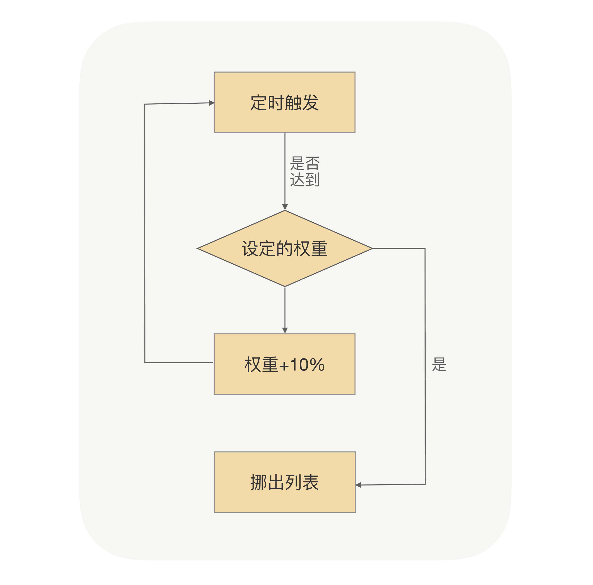
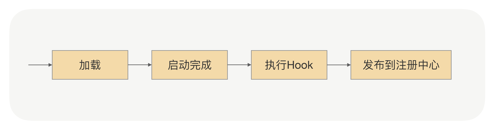

## 启动预热

那什么叫启动预热呢？

简单来说，就是让刚启动的服务提供方应用不承担全部的流量，而是让它被调用的次数随着时间的移动慢慢增加，最终让流量缓和地增加到跟已经运行一段时间后的水平一样。

那在RPC里面，我们该怎么实现这个功能呢？

我们现在是要控制调用方发送到服务提供方的流量。我们可以先简单地回顾下调用方发起的RPC调用流程是怎样的，调用方应用通过服务发现能够获取到服务提供方的IP地址，然后每次发送请求前，都需要通过负载均衡算法从连接池中选择一个可用连接。那这样的话，我们是不是就可以让负载均衡在选择连接的时候，区分一下是否是刚启动不久的应用？对于刚启动的应用，我们可以让它被选择到的概率特别低，但这个概率会随着时间的推移慢慢变大，从而实现一个动态增加流量的过程。

现在方案有了，我们就可以考虑具体实现了。

首先对于调用方来说，我们要知道服务提供方启动的时间，这个怎么获取呢？我这里给出两种方法，一种是服务提供方在启动的时候，把自己启动的时间告诉注册中心；另外一种就是注册中心收到的服务提供方的请求注册时间。这两个时间我认为都可以，不过可能你会犹豫我们该怎么确保所有机器的日期时间是一样的？这其实不用太关心，因为整个预热过程的时间是一个粗略值，即使机器之间的日期时间存在1分钟的误差也不影响，并且在真实环境中机器都会默认开启NTP时间同步功能，来保证所有机器时间的一致性。

不管你是选择哪个时间，最终的结果就是，调用方通过服务发现，除了可以拿到IP列表，还可以拿到对应的启动时间。我们需要把这个时间作用在负载均衡上，在[第 11 讲] 我们介绍过一种基于权重的负载均衡，但是这个权重是由服务提供方设置的，属于一个固定状态。现在我们要让这个权重变成动态的，并且是随着时间的推移慢慢增加到服务提供方设定的固定值，整个过程如下图所示：

通过这个小逻辑的改动，我们就可以保证当服务提供方运行时长小于预热时间时，对服务提供方进行降权，减少被负载均衡选择的概率，避免让应用在启动之初就处于高负载状态，从而实现服务提供方在启动后有一个预热的过程。

看到这儿，你可能还会有另外一个疑问，就是当我在大批量重启服务提供方的时候，会不会导致没有重启的机器因为扛的流量太大而出现问题？

关于这个问题，我是这么考虑的。当你大批量重启服务提供方的时候，对于调用方来说，这些刚重启的机器权重基本是一样的，也就是说这些机器被选中的概率是一样的，大家都是一样得低，也就不存在权重区分的问题了。但是对于那些没有重启过的应用提供方来说，它们被负载均衡选中的概率是相对较高的，但是我们可以通过[第 11 讲] 学到的自适应负载的方法平缓地切换，所以也是没有问题的。

启动预热更多是从调用方的角度出发，去解决服务提供方应用冷启动的问题，让调用方的请求量通过一个时间窗口过渡，慢慢达到一个正常水平，从而实现平滑上线。但对于服务提供方本身来说，有没有相关方案可以实现这种效果呢？

当然有，这也是我今天要分享的另一个重点，和热启动息息相关，那就是延迟暴露。

## 延迟暴露

我们应用启动的时候都是通过main入口，然后顺序加载各种相关依赖的类。以Spring应用启动为例，在加载的过程中，Spring容器会顺序加载Spring Bean，如果某个Bean是RPC服务的话，我们不光要把它注册到Spring-BeanFactory里面去，还要把这个Bean对应的接口注册到注册中心。注册中心在收到新上线的服务提供方地址的时候，会把这个地址推送到调用方应用内存中；当调用方收到这个服务提供方地址的时候，就会去建立连接发请求。

但这时候是不是存在服务提供方可能并没有启动完成的情况？因为服务提供方应用可能还在加载其它的Bean。对于调用方来说，只要获取到了服务提供方的IP，就有可能发起RPC调用，但如果这时候服务提供方没有启动完成的话，就会导致调用失败，从而使业务受损。

那有什么办法可以避免这种情况吗？

在解决问题前，我们先看下出现上述问题的根本原因。这是因为服务提供方应用在没有启动完成的时候，调用方的请求就过来了，而调用方请求过来的原因是，服务提供方应用在启动过程中把解析到的RPC服务注册到了注册中心，这就导致在后续加载没有完成的情况下服务提供方的地址就被服务调用方感知到了。

这样的话，其实我们就可以把接口注册到注册中心的时间挪到应用启动完成后。具体的做法就是在应用启动加载、解析Bean的时候，如果遇到了RPC服务的Bean，只先把这个Bean注册到Spring-BeanFactory里面去，而并不把这个Bean对应的接口注册到注册中心，只有等应用启动完成后，才把接口注册到注册中心用于服务发现，从而实现让服务调用方延迟获取到服务提供方地址。

这样是可以保证应用在启动完后才开始接入流量的，但其实这样做，我们还是没有实现最开始的目标。因为这时候应用虽然启动完成了，但并没有执行相关的业务代码，所以JVM内存里面还是冷的。如果这时候大量请求过来，还是会导致整个应用在高负载模式下运行，从而导致不能及时地返回请求结果。而且在实际业务中，一个服务的内部业务逻辑一般会依赖其它资源的，比如缓存数据。如果我们能在服务正式提供服务前，先完成缓存的初始化操作，而不是等请求来了之后才去加载，我们就可以降低重启后第一次请求出错的概率。

那具体怎么实现呢？

我们还是需要利用服务提供方把接口注册到注册中心的那段时间。我们可以在服务提供方应用启动后，接口注册到注册中心前，预留一个Hook过程，让用户可以实现可扩展的Hook逻辑。用户可以在Hook里面模拟调用逻辑，从而使JVM指令能够预热起来，并且用户也可以在Hook里面事先预加载一些资源，只有等所有的资源都加载完成后，最后才把接口注册到注册中心。整个应用启动过程如下图所示：

包括[第 11 讲] 在内，到今天为止，我们就已经把整个RPC里面的启停机流程都讲完了。就像前面说过的那样，虽然启停机流程看起来不属于RPC主流程，但是如果你能在RPC里面把这些“微小”的工作做好，就可以让你的技术团队感受到更多的微服务带来的好处。

另外，我们今天的两大重点——启动预热与延迟暴露，它们并不是RPC的专属功能，我们在开发其它系统时，也可以利用这两点来减少冷启动对业务的影响。