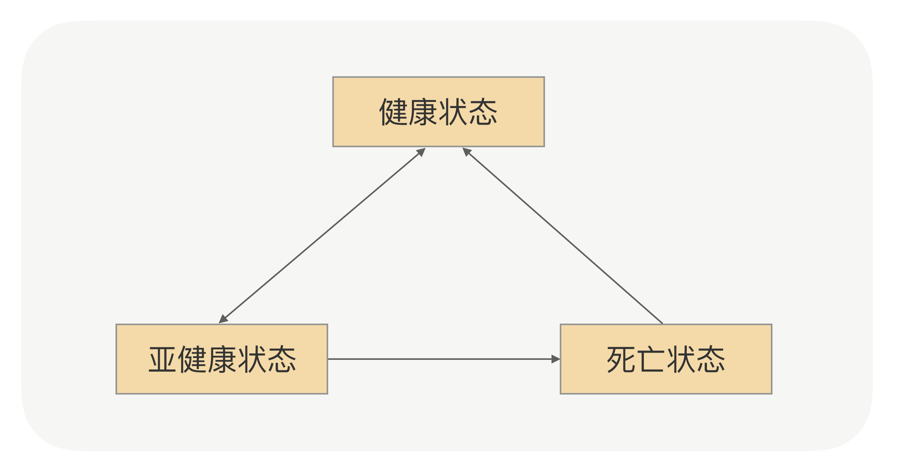

## 健康检测的逻辑

- 健康状态：建立连接成功，并且心跳探活也一直成功；
- 亚健康状态：建立连接成功，但是心跳请求连续失败；
- 死亡状态：建立连接失败。

这里你可以关注下几个状态之间的转换箭头，我再给你解释下。首先，一开始初始化的时候，如果建立连接成功，那就是健康状态，否则就是死亡状态。这里没有亚健康这样的中间态。紧接着，如果健康状态的节点连续出现几次不能响应心跳请求的情况，那就会被标记为亚健康状态，也就是说，服务调用方会觉得它生病了。

生病之后（亚健康状态），如果连续几次都能正常响应心跳请求，那就可以转回健康状态，证明病好了。如果病一直好不了，那就会被断定为是死亡节点，死亡之后还需要善后，比如关闭连接。

当然，死亡并不是真正死亡，它还有复活的机会。如果某个时间点里，死亡的节点能够重连成功，那它就可以重新被标记为健康状态。

这就是整个节点的状态转换思路，你不用死记，它很简单，除了不能复活，其他都和我们人的状态一样。当服务调用方通过心跳机制了解了节点的状态之后，每次发请求的时候，就可以优先从健康列表里面选择一个节点。当然，如果健康列表为空，为了提高可用性，也可以尝试从亚健康列表里面选择一个，这就是具体的策略了。

## 具体的解决方案

理解了服务健康检测的逻辑，我们再回到开头我描述的场景里，看看怎么优化。现在你理解了，一个节点从健康状态过渡到亚健康状态的前提是“连续”心跳失败次数必须到达某一个阈值，比如3次（具体看你怎么配置了）。

而我们的场景里，节点的心跳日志只是间歇性失败，也就是时好时坏，这样，失败次数根本没到阈值，调用方会觉得它只是“生病”了，并且很快就好了。那怎么解决呢？我还是建议你先停下来想想。

你是不是会脱口而出，说改下配置，调低阈值呗。是的，这是最快的解决方法，但是我想说，它治标不治本。第一，像前面说的那样，调用方跟服务节点之间网络状况瞬息万变，出现网络波动的时候会导致误判。第二，在负载高情况，服务端来不及处理心跳请求，由于心跳时间很短，会导致调用方很快触发连续心跳失败而造成断开连接。

我们回到问题的本源，核心是服务节点网络有问题，心跳间歇性失败。我们现在判断节点状态只有一个维度，那就是心跳检测，那是不是可以再加上业务请求的维度呢？

起码我当时是顺着这个方向解决问题的。但紧接着，我又发现了新的麻烦：

- 调用方每个接口的调用频次不一样，有的接口可能1秒内调用上百次，有的接口可能半个小时才会调用一次，所以我们不能把简单的把总失败的次数当作判断条件。
- 服务的接口响应时间也是不一样的，有的接口可能1ms，有的接口可能是10s，所以我们也不能把TPS至来当作判断条件。

和同事讨论之后，我们找到了可用率这个突破口，应该相对完美了。可用率的计算方式是某一个时间窗口内接口调用成功次数的百分比（成功次数/总调用次数）。当可用率低于某个比例就认为这个节点存在问题，把它挪到亚健康列表，这样既考虑了高低频的调用接口，也兼顾了接口响应时间不同的问题。

除了在RPC框架里面我们会有采用定时“健康检测”，其实在其它分布式系统设计的时候也会用到“心跳探活”机制。

比如在应用监控系统设计的时候，需要对不健康的应用实例进行报警，好让运维人员及时处理。和咱们RPC的例子一样，在这个场景里，你也不能简单地依赖端口的连通性来判断应用是否存活，因为在端口连通正常的情况下，应用也可能僵死了。

那有啥其他办法能处理应用僵死的情况吗？我们可以让每个应用实例提供一个“健康检测”的URL，检测程序定时通过构造HTTP请求访问该URL，然后根据响应结果来进行存活判断，这样就可以防止僵死状态的误判。你想想，这不就是咱们前面讲到的心跳机制吗？

不过，这个案例里，我还要卖个关子。加完心跳机制，是不是就没有问题了呢？当然不是，因为检测程序所在的机器和目标机器之间的网络可能还会出现故障，如果真出现了故障，不就会误判吗？你以为人家已经生病或者挂了，其实是心跳仪器坏了…

根据我的经验，有一个办法可以减少误判的几率，那就是把检测程序部署在多个机器里面，分布在不同的机架，甚至不同的机房。因为网络同时故障的概率非常低，所以只要任意一个检测程序实例访问目标机器正常，就可以说明该目标机器正常。