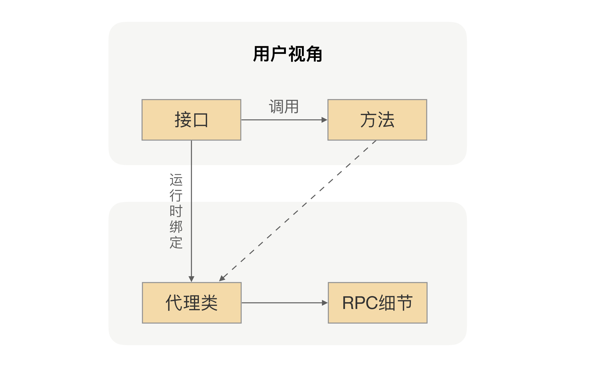

## 远程调用的魔法

在项目中，当我们要使用 RPC 的时候，我们一般的做法是先找服务提供方要接口，通过 Maven 或者其他的工具把接口依赖到我们项目中。我们在编写业务逻辑的时候，如果要调用提供方的接口，我们就只需要通过依赖注入的方式把接口注入到项目中就行了，然后在代码里面直接调用接口的方法 。

我们都知道，接口里并不会包含真实的业务逻辑，业务逻辑都在服务提供方应用里，但我们通过调用接口方法，确实拿到了想要的结果，是不是感觉有点神奇呢？想一下，在 RPC 里面，我们是怎么完成这个魔术的。

这里面用到的核心技术就是前面说的动态代理。RPC 会自动给接口生成一个代理类，当我们在项目中注入接口的时候，运行过程中实际绑定的是这个接口生成的代理类。这样在接口方法被调用的时候，它实际上是被生成代理类拦截到了，这样我们就可以在生成的代理类里面，加入远程调用逻辑。

通过这种“偷梁换柱”的手法，就可以帮用户屏蔽远程调用的细节，实现像调用本地一样地调用远程的体验，整体流程如下图所示：



## 实现原理

```java
/**
 * 要代理的接口
 */
public interface Hello {
    String say();
}

/**
 * 真实调用对象
 */
public class RealHello {

    public String invoke(){
        return "i'm proxy";
    }
}

/**
 * JDK代理类生成
 */
public class JDKProxy implements InvocationHandler {
    private Object target;

    JDKProxy(Object target) {
        this.target = target;
    }

    @Override
    public Object invoke(Object proxy, Method method, Object[] paramValues) {
        return ((RealHello)target).invoke();
    }
}

/**
 * 测试例子
 */
public class TestProxy {

    public static void main(String[] args){
        // 构建代理器
        JDKProxy proxy = new JDKProxy(new RealHello());
        ClassLoader classLoader = ClassLoaderUtils.getCurrentClassLoader();
        // 把生成的代理类保存到文件
System.setProperty("sun.misc.ProxyGenerator.saveGeneratedFiles","true");
        // 生成代理类
        Hello test = (Hello) Proxy.newProxyInstance(classLoader, new Class[]{Hello.class}, proxy);
        // 方法调用
        System.out.println(test.say());
    }
}

```


相对 JDK 自带的代理功能，Javassist的定位是能够操纵底层字节码，所以使用起来并不简单，要生成动态代理类恐怕是有点复杂了。但好的方面是，通过Javassist生成字节码，不需要通过反射完成方法调用，所以性能肯定是更胜一筹的。在使用中，我们要注意一个问题，通过Javassist生成一个代理类后，此 CtClass 对象会被冻结起来，不允许再修改；否则，再次生成时会报错。

Byte Buddy 则属于后起之秀，在很多优秀的项目中，像Spring、Jackson都用到了Byte Buddy来完成底层代理。相比Javassist，Byte Buddy提供了更容易操作的API，编写的代码可读性更高。更重要的是，生成的代理类执行速度比Javassist更快。

虽然以上这三种框架使用的方式相差很大，但核心原理却是差不多的，区别就只是通过什么方式生成的代理类以及在生成的代理类里面是怎么完成的方法调用。同时呢，也正是因为这些细小的差异，才导致了不同的代理框架在性能方面的表现不同。因此，我们在设计RPC框架的时候，还是需要进行一些比较的，具体你可以综合它们的优劣以及你的场景需求进行选择。


## 既然动态代理是一种具体的技术框架，那就会涉及到选型。我们可以从这样三个角度去考虑：


- 因为代理类是在运行中生成的，那么代理框架生成代理类的速度、生成代理类的字节码大小等等，都会影响到其性能——生成的字节码越小，运行所占资源就越小。
- 还有就是我们生成的代理类，是用于接口方法请求拦截的，所以每次调用接口方法的时候，都会执行生成的代理类，这时生成的代理类的执行效率就需要很高效。
- 最后一个是从我们的使用角度出发的，我们肯定希望选择一个使用起来很方便的代理类框架，比如我们可以考虑：API设计是否好理解、社区活跃度、还有就是依赖复杂度等等。