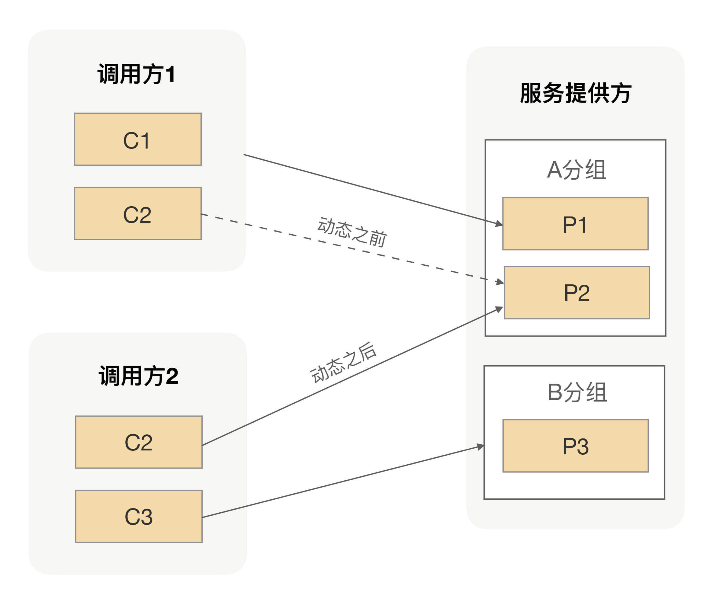

## 分组后容量评估

通过人为分组的方式确实能帮服务提供方硬隔离调用方的流量，让不同的调用方拥有自己独享的集群，从而保障各个调用方之间互不影响。但这对于我们服务提供方来说，又带来了一个新的问题，就是我们该给调用方分配多大的集群才合适呢？

在[第 16 讲] 我们也有聊到过这样的问题，就是该怎么划分集群的分组？当然，最理想的情况就是给每个调用方都分配一个独立的分组，但是如果在服务提供方的调用方相对比较多的情况下，对于服务提供方来说要维护这些关系还是比较困难的。因此实际在给集群划分分组的时候，我们一般会选择性地合并一些调用方到同一个分组里。这就需要我们服务提供方考虑该怎么合并，且合并哪些调用方？

因为这个问题并没有统一的标准，所以我当时给的建议就是我们可以按照应用的重要级别来划分，让非核心业务应用跟核心业务应用不要公用一个分组，核心应用之间也最好别用同一个分组。但这只是一个划分集群分组的建议，并没有具体告诉你该如何划分集群大小。换句话就是，你可以按照这个原则去规划设计自己的集群要分多少个组。

按照上面的原则，我们把整个集群从逻辑上分为不同的分组之后，接下来我们要做的事情就是给每个分组分配相应的机器数量。那每个分组对应的机器数量，我们该怎么计算呢？我相信这个问题肯定难不倒你。在这儿我先分享下我们团队常用的做法，我们一般会先通过压测去评估下服务提供方单台机器所能承受的QPS，然后再计算出每个分组里面的所有调用方的调用总量。有了这两个值之后，我们就能很容易地计算出这个分组所需要的机器数。

通过计算分组内所有调用方QPS的方式来算出单个分组内所需的机器数，整体而言还是比较客观准确的。但因为每个调用方的调用量并不是一成不变的，比如商家找个网红做个直播卖货，那就很有可能会导致今天的下单量相对昨天有小幅度的上涨。就是因为这些不确定性因素的存在，所以服务提供方在给调用方做容量评估的时候，通常都会在现有调用量的基础上加一个百分比，而这个百分比多半来自历史经验总结。

总之，就是在我们算每个分组所需要的机器数的时候，需要额外给每个分组增加一些机器，从而让每个小集群有一定的抗压能力，而这个抗压能力取决于给这个集群预留的机器数量。作为服务提供方来说，肯定希望给每个集群预留的机器数越多越好，但现实情况又不允许预留太多，因为这样会增加团队的整体成本。

## 分组带来的问题

通过给分组预留少量机器的方式，以增加单个集群的抗压能力。一般情况下，这种机制能够运行得很好，但在应对大的突发流量时，就会显得有点捉襟见肘了。因为机器成本的原因，我们给每个分组预留的机器数量都不会太多，所以当突发流量超过预留机器的能力的时候，就会让这个分组的集群处于一个危险状态了。

这时候我们唯一能做的就是给这个分组去扩容新的机器，但临时扩容新机器通常需要一个比较长的时间，而且花的时间越长，业务受影响的范围就越大。

那有没有更便捷一点的方案呢？前面我们说过，我们在给分组做容量评估的时候，通常都会增加了一些富余。换句话就是，除了当前出问题的分组，其它分组的服务提供方在保障自己调用方质量的同时，还是可以额外承担一些流量的。我们可以想办法快速利用这部分已有的能力。

但因为我们实现了流量隔离功能，整个集群被我们划分成了不同的分组，所以当前出问题的调用方并不能把请求发送到其它分组的机器上。那可能你会说，既然临时去申请机器进行扩容时间长，那我能不能把上面说的那些富余的机器直接拿过来，把部署在机器上的应用改成出问题的分组，然后进行重启啊？这样出问题的那个分组的服务提供方机器数就会变多了。

从结果上来看，这样处理确实能够解决问题，但有一个问题就是这样处理的时间还是相对较长的，而且当这个分组的流量恢复后，你还得把临时借过来的机器还回原来的分组。

问题分析到这儿，我想说，动态分组就可以派上用场了。

## 动态分组的应用

上面的问题，其根本原因就是某个分组的调用方流量突增，而这个分组所预留的空间也不能满足当前流量的需求，但是其它分组的服务提供方有足够的富余能力。但这些富余的能力，又被我们的分组进行了强制的隔离，我们又不能抛弃分组功能，否则老问题就要循环起来了。

那这样的话，我们就只能在出问题的时候临时去借用其它分组的部分能力，但通过改分组进行重启应用的方式，不仅操作过程慢，事后还得恢复。因此这种生硬的方式显然并不是很合适。

想一下啊，我们改应用分组然后进行重启的目的，就是让出问题的服务调用方能通过服务发现找到更多的服务提供方机器，而服务发现的数据来自注册中心，那我们是不是可以通过修改注册中心的数据来解决呢？

我们只要把注册中心里面的部分实例的别名改成我们想要的别名，然后通过服务发现进而影响到不同调用方能够调用的服务提供方实例集合。

举个例子，服务提供方有3个服务实例，其中A分组有2个实例，B分组有1个实例，调用方1调用A分组，调用方2调用B分组。我们把A分组里面的一个实例分组在注册中心由A分组改为B分组，经过服务发现影响后，整个调用拓扑就变成了这样：

通过直接修改注册中心数据，我们可以让任何一个分组瞬间拥有不同规模的集群能力。我们不仅可以实现把某个实例的分组名改成另外一个分组名，还可以让某个实例分组名变成多个分组名，这就是我们在动态分组里面最常见的两种动作——追加和替换。

## 在服务治理的过程中，我们通常会给服务进行逻辑分组，但之后某个分组可能会遇到突发流量调用的问题，在本讲我给出了一个动态分组的方案。但是动态分组的过程中，我们只是把注册中心的数据改了，而服务提供方提供真实的分组名并没有改变，这时候用动态分组名的调用方调用过来的请求可能就会报错，因为服务提供方会验证调用方过来的分组名跟自身的是否一样。针对这个问题，你能想到什么解决方案？

### 调整服务提供方验证逻辑

- **增加兼容判断**：服务提供方在验证分组名时，不仅判断调用方的分组名是否与自身完全一致，还增加逻辑来判断是否属于允许的动态分组范围。例如，设置一个可配置的白名单，当调用方的分组名在白名单内时，即使与自身当前分组名不同，也允许请求通过。这样可以在不改变原有分组名验证机制核心逻辑的基础上，增加对动态分组的支持。
- **基于环境变量判断**：通过设置环境变量来标识当前是否处于动态分组调整阶段。在服务提供方的验证逻辑中，先检查环境变量，如果处于动态分组调整阶段，则放宽对分组名的验证要求，允许调用方的分组名与自身不同的请求通过；调整结束后，再恢复严格的验证。

### 采用中间层代理

- **分组名转换代理**：在调用方和服务提供方之间引入一个代理层。代理层拦截调用方的请求，根据注册中心的动态分组信息，将调用方请求中的分组名转换为服务提供方能够识别的分组名，然后再将请求转发给服务提供方。这样，对于服务提供方来说，收到的请求分组名始终是符合其验证要求的，而调用方则无需感知分组名的转换过程。
- **请求路由代理**：代理层根据注册中心的动态分组信息，以及服务提供方的实际分组情况，动态地将调用方的请求路由到正确的服务实例上。代理层可以维护一个分组名到服务实例地址的映射表，根据请求中的分组名来选择合适的服务实例进行转发，从而避开服务提供方对分组名的直接验证。

### 动态更新服务提供方分组名

- **主动推送更新**：当注册中心的分组信息发生变化时，由注册中心主动将新的分组名推送给服务提供方。服务提供方接收到更新后，立即更新自身的分组名，使其与注册中心一致，从而能够正确验证调用方的分组名。这种方式可以保证服务提供方的分组名及时与注册中心同步，减少因分组名不一致导致的报错。
- **定时拉取更新**：服务提供方定时从注册中心拉取分组信息，检查是否有更新。如果发现注册中心的分组名与自身不同，则更新自身的分组名。通过设置合适的拉取间隔，可以在一定程度上保证分组名的一致性，同时避免过于频繁地请求注册中心导致性能问题。

