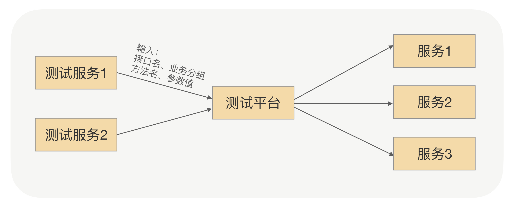
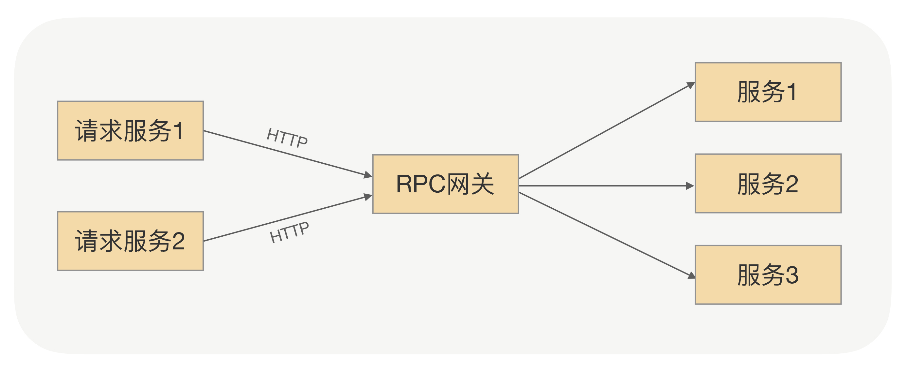

## 怎么做？

RPC框架要实现这个功能，我们可以使用泛化调用。那什么是泛化调用呢？我们带着这个问题，先学习下如何在没有接口的情况下进行RPC调用。

我们先回想下我在基础篇讲过的内容，通过前面的学习我们了解到，在RPC调用的过程中，调用端向服务端发起请求，首先要通过动态代理，正如[第 05 讲] 中我说过的，动态代理可以帮助我们屏蔽RPC处理流程，真正地让我们发起远程调用就像调用本地一样。

那么在RPC调用的过程中，既然调用端是通过动态代理向服务端发起远程调用的，那么在调用端的程序中就一定要依赖服务提供方提供的接口API，因为调用端是通过这个接口API自动生成动态代理的。那如果没有接口API呢？我们该如何让调用端仍然能够发起RPC调用呢？

所谓的RPC调用，本质上就是调用端向服务端发送一条请求消息，服务端接收并处理，之后向调用端发送一条响应消息，调用端处理完响应消息之后，一次RPC调用就完成了。那是不是说我们只要能够让调用端在没有服务提供方提供接口的情况下，仍然能够向服务端发送正确的请求消息，就能够解决这个问题了呢？

没错，只要调用端将服务端需要知道的信息，如接口名、业务分组名、方法名以及参数信息等封装成请求消息发送给服务端，服务端就能够解析并处理这条请求消息，这样问题就解决了。过程如下图所示：

现在我们已经清楚了解决问题的关键，但RPC的调用端向服务端发送消息是需要以动态代理作为入口的，我们现在得继续想办法让调用端发送我刚才讲过的那条请求消息。

我们可以定义一个统一的接口（GenericService），调用端在创建GenericService代理时指定真正需要调用的接口的接口名以及分组名，而GenericService接口的$invoke方法的入参就是方法名以及参数信息。

这样我们传递给服务端所需要的所有信息，包括接口名、业务分组名、方法名以及参数信息等都可以通过调用GenericService代理的$invoke方法来传递。具体的接口定义如下：

class GenericService {

Object $invoke(String methodName, String[] paramTypes, Object[] params);

}
这个通过统一的GenericService接口类生成的动态代理，来实现在没有接口的情况下进行RPC调用的功能，我们就称之为泛化调用。

通过泛化调用功能，我们可以解决在没有服务提供方提供接口API的情况下进行RPC调用，那么这个功能是否就完美了呢？

回顾下[第 17 讲] 我过的内容，RPC框架可以通过异步的方式提升吞吐量，还有如何实现全异步的RPC框架，其关键点就是RPC框架对CompletableFuture的支持，那么我们的泛化调用是否也可以支持异步呢？

当然可以。我们可以给GenericService接口再添加一个异步方法$asyncInvoke，方法的返回值就是CompletableFuture，GenericService接口的具体定义如下：

class GenericService {

Object $invoke(String methodName, String[] paramTypes, Object[] params);

CompletableFuture<Object> $asyncInvoke(String methodName, String[] paramTypes, Object[] params);

}
学到这里相信你已经对泛化调用的功能有一定的了解了，那你有没有想过这样一个问题？在没有服务提供方提供接口API的情况下，我们可以用泛化调用的方式实现RPC调用，但是如果没有服务提供方提供接口API，我们就没法得到入参以及返回值的Class类，也就不能对入参对象进行正常的序列化。这时我们会面临两个问题：

问题1：调用端不能对入参对象进行正常的序列化，那调用端、服务端在接收到请求消息后，入参对象又该如何序列化与反序列化呢？

回想下[第 07 讲]，在这一讲中我讲解了如何设计可扩展的RPC框架，我们通过插件体系来提高RPC框架的可扩展性，在RPC框架的整体架构中就包括了序列化插件，我们可以为泛化调用提供专属的序列化插件，通过这个插件，解决泛化调用中的序列化与反序列化问题。

问题2：调用端的入参对象（params）与返回值应该是什么类型呢？

在服务提供方提供的接口API中，被调用的方法的入参类型是一个对象，那么使用泛化调用功能的调用端，可以使用Map类型的对象，之后通过泛化调用专属的序列化方式对这个Map对象进行序列化，服务端收到消息后，再通过泛化调用专属的序列化方式将其反序列成对象。

今天我们主要讲解了如何在没有接口的情况下进行RPC调用，泛化调用的功能可以实现这一目的。

这个功能的实现原理，就是RPC框架提供统一的泛化调用接口（GenericService），调用端在创建GenericService代理时指定真正需要调用的接口的接口名以及分组名，通过调用GenericService代理的$invoke方法将服务端所需要的所有信息，包括接口名、业务分组名、方法名以及参数信息等封装成请求消息，发送给服务端，实现在没有接口的情况下进行RPC调用的功能。

而通过泛化调用的方式发起调用，由于调用端没有服务端提供方提供的接口API，不能正常地进行序列化与反序列化，我们可以为泛化调用提供专属的序列化插件，来解决实际问题。
## 应用场景有哪些？
在RPC运营的过程中，让调用端在没有接口API的情况下发起RPC调用的需求，不只是一个业务方和我提过，这里我列举两个非常典型的场景例子。

场景一：我们要搭建一个统一的测试平台，可以让各个业务方在测试平台中通过输入接口、分组名、方法名以及参数值，在线测试自己发布的RPC服务。这时我们就有一个问题要解决，我们搭建统一的测试平台实际上是作为各个RPC服务的调用端，而在RPC框架的使用中，调用端是需要依赖服务提供方提供的接口API的，而统一测试平台不可能依赖所有服务提供方的接口API。我们不能因为每有一个新的服务发布，就去修改平台的代码以及重新上线。这时我们就需要让调用端在没有服务提供方提供接口的情况下，仍然可以正常地发起RPC调用。

场景二：我们要搭建一个轻量级的服务网关，可以让各个业务方用HTTP的方式，通过服务网关调用其它服务。这时就有与场景一相同的问题，服务网关要作为所有RPC服务的调用端，是不能依赖所有服务提供方的接口API的，也需要调用端在没有服务提供方提供接口的情况下，仍然可以正常地发起RPC调用。

## 在讲解泛化调用时，我讲到服务端在收到调用端通过泛化调用的方式发送过来的请求时，会使用泛化调用专属的序列化插件实现对其进行反序列化，那么服务端是如何判定这个请求消息是通过泛化调用的方式发送过来的消息呢？

服务端通常可以通过以下几种方式来判定请求消息是否是通过泛化调用的方式发送过来的：

- **消息头标识**：在请求消息的消息头中设置特定的标识字段，用于表明该请求是泛化调用请求。例如，定义一个名为 `X - Generalized - Call` 的消息头字段，当该字段的值为特定标识（如 `true` 或 `1`）时，服务端就知道这是一个泛化调用请求。这样服务端在接收到请求后，首先检查消息头中的这个字段，就可以快速判断是否需要使用泛化调用专属的序列化插件进行反序列化。
- **特定的请求路径或端点**：为泛化调用设置专门的请求路径或端点。例如，所有泛化调用的请求都发送到 `/generalized - call` 这个路径下，而正常的非泛化调用则使用其他不同的路径。服务端通过检查请求的路径来确定是否为泛化调用请求。当接收到的请求路径匹配到泛化调用的特定路径时，就使用相应的处理方式，包括使用泛化调用专属的序列化插件进行反序列化。
- **请求消息的特定格式或内容特征**：泛化调用的请求消息可能具有特定的格式或内容特征，服务端可以根据这些特征来判断。例如，泛化调用的消息体可能采用特定的 JSON 格式，其中包含一些固定的字段和结构，用于描述调用的目标服务、方法以及参数等信息。服务端在接收到请求后，尝试按照泛化调用消息的格式进行解析，如果能够成功解析并符合泛化调用的格式要求，就可以判定为泛化调用请求。
- **通过调用上下文信息**：在某些框架或中间件中，可以通过调用上下文来传递一些额外的信息。例如，在 RPC 框架中，可以在上下文对象中设置一个标志位来表示当前请求是否是泛化调用。服务端在处理请求时，可以从上下文中获取这个标志位的值，从而判断是否是泛化调用请求。这种方式需要框架或中间件本身支持上下文信息的传递和获取。