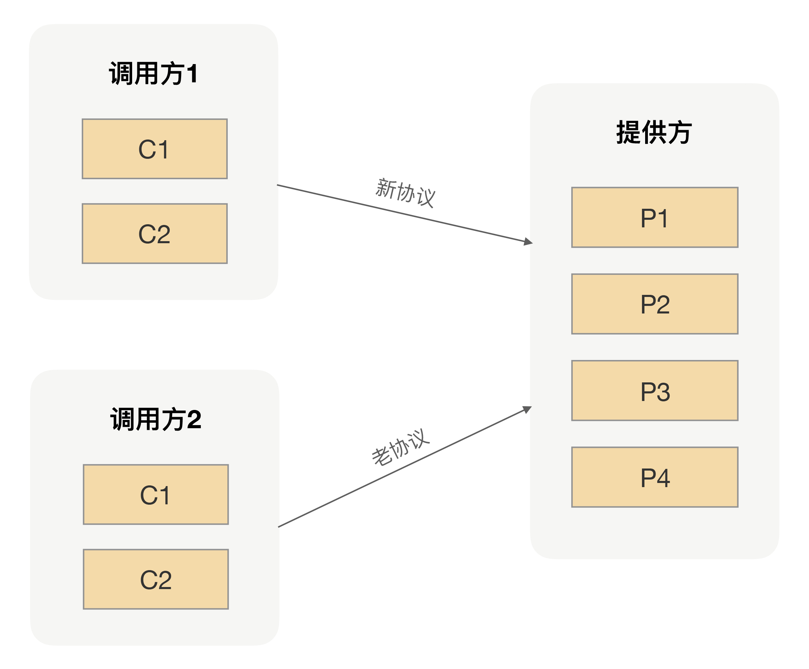
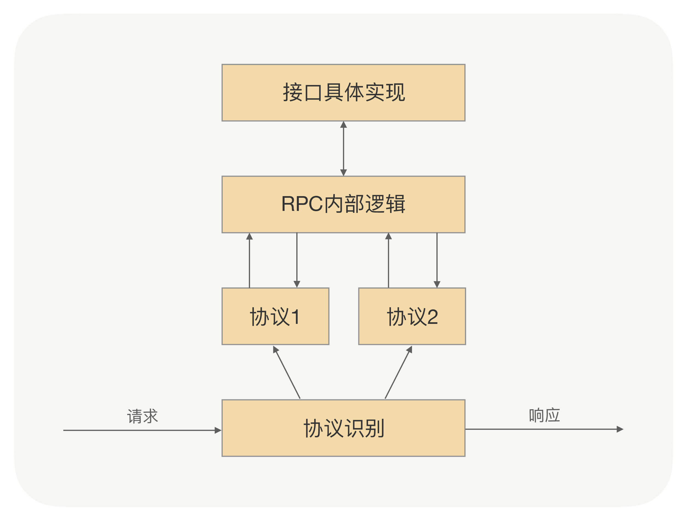

## 为什么要支持多协议？

既然应用之间的通信都是通过RPC来完成的，而能够完成RPC通信的工具有很多，比如像Web Service、Hessian、gRPC等都可以用来充当RPC使用。这些不同的RPC框架都是随着互联网技术的发展而慢慢涌现出来的，而这些RPC框架可能在不同时期会被我们引入到不同的项目中解决当时应用之间的通信问题，这样就导致我们线上的生成环境中存在各种各样的RPC框架。

很显然，这种混乱使用RPC框架的方式肯定不利于公司技术栈的管理，最明显的一个特点就是我们维护RPC框架的成本越来越高，因为每种RPC框架都需要有专人去负责升级维护。

为了解决早期遗留的一些技术负债，我们通常会去选择更高级的、更好用的工具来解决，治理RPC框架混乱的问题也是一样。为了解决同时维护多个RPC框架的困难，我们肯定希望能够用统一用一种RPC框架来替代线上所有的RPC框架，这样不仅能降低我们的维护成本，而且还可以让我们在一种RPC上面去精进。

既然目标明确后，我们该如何实施呢？

可能你会说这很简单啊，我们只要把所有的应用都改造成新RPC的使用方式，然后同时上线所有改造后的应用就可以了。如果在团队比较小的情况下，这种断崖式的更新可能确实是最快的方法，但如果是在团队比较大的情况下，要想做到同时上线所有改造后的应用，暂且不讨论这种方式是否存在风险，光从多个团队同一时间上线所有应用来看，这也几乎是一件不可能做到的事儿。

那对于多人团队来说，有什么办法可以让其把多个RPC框架统一到一个工具上呢？我们先看下多人团队在升级过程中所要面临的困难，人数多就意味着要维护的应用会比较多，应用多了之后线上应用之间的调用关系就会相对比较复杂。那这时候如果单纯地把任意一个应用目前使用的RPC框架换成新的RPC框架的话，就需要让所有调用这个应用的调用方去改成新的调用方式。

通过这种自下而上的滚动升级方式，最终是可以让所有的应用都切换到统一的RPC框架上，但是这种升级方式存在一定的局限性，首先要求我们能够清楚地梳理出各个应用之间的调用关系，只有这样，我们才能按部就班地把所有应用都升级到新的RPC框架上；其次要求应用之间的关系不能存在互相调用的情况，最好的情况就是应用之间的调用关系像一颗树，有一定的层次关系。但实际上我们应用的调用关系可能已经变成了网状结构，这时候想再按照这种方式去推进升级的话，就可能寸步难行了。

为了解决上面升级过程中遇到的问题，你可能还会想到另外一个方案，那就是在应用升级的过程中，先不移除原有的RPC框架，但同时接入新的RPC框架，让两种RPC同时提供服务，然后等所有的应用都接入完新的RPC以后，再让所有的应用逐步接入到新的RPC上。这样既解决了上面存在的问题，同时也可以让所有的应用都能无序地升级到统一的RPC框架上。

在保持原有RPC使用方式不变的情况下，同时引入新的RPC框架的思路，是可以让所有的应用最终都能升级到我们想要升级的RPC上，但对于开发人员来说，这样切换成本还是有点儿高，整个过程最少需要两次上线才能彻底地把应用里面的旧RPC都切换成新RPC。

那有没有更好的方式可以让应用上线一次就可以完成新老RPC的切换呢？关键就在于要让新的RPC能同时支持多种RPC调用，当一个调用方切换到新的RPC之后，调用方和服务提供方之间就可以用新的协议完成调用；当调用方还是用老的RPC进行调用的话，调用方和服务提供方之间就继续沿用老的协议完成调用。对于服务提供方来说，所要处理的请求关系如下图所示：

## 怎么优雅处理多协议？

要让新的RPC同时支持多种RPC调用，关键就在于要让新的RPC能够原地支持多种协议的请求。怎么才能做到？在[第 02 讲] 我们说过，协议的作用就是用于分割二进制数据流。每种协议约定的数据包格式是不一样的，而且每种协议开头都有一个协议编码，我们一般叫做magic number。

当RPC收到了数据包后，我们可以先解析出magic number来。获取到magic number后，我们就很容易地找到对应协议的数据格式，然后用对应协议的数据格式去解析收到的二进制数据包。

协议解析过程就是把一连串的二进制数据变成一个RPC内部对象，但这个对象一般是跟协议相关的，所以为了能让RPC内部处理起来更加方便，我们一般都会把这个协议相关的对象转成一个跟协议无关的RPC对象。这是因为在RPC流程中，当服务提供方收到反序列化后的请求的时候，我们需要根据当前请求的参数找到对应接口的实现类去完成真正的方法调用。如果这个请求参数是跟协议相关的话，那后续RPC的整个处理逻辑就会变得很复杂。

当完成了真正的方法调用以后，RPC返回的也是一个跟协议无关的通用对象，所以在真正往调用方写回数据的时候，我们同样需要完成一个对象转换的逻辑，只不过这时候是把通用对象转成协议相关的对象。

在收发数据包的时候，我们通过两次转换实现RPC内部的处理逻辑跟协议无关，同时保证调用方收到的数据格式跟调用请求过来的数据格式是一样的。整个流程如下图所示：

在我们日常开发的过程中，最难的环节不是从0到1完成一个新应用的开发，而是把一个老应用通过架构升级完成从70分到80分的跳跃。因为在老应用升级的过程中，我们不仅需要考虑既有的功能逻辑，也需要考虑切换到新架构上的成本，这就要求我们在设计新架构的时候要考虑如何让老应用能够平滑地升级，就像在RPC里面支持多协议一样。

在RPC里面支持多协议，不仅能让我们更从容地推进应用RPC的升级，还能为未来在RPC里面扩展新协议奠定一个良好的基础。所以我们平时在设计应用架构的时候，不仅要考虑应用自身功能的完整性，还需要考虑应用的可运维性，以及是否能平滑升级等一些软性能力。

## 在RPC里面支持多协议的时候，有一个关键点就是能够识别出不同的协议，并且根据不同的magic number找到不同协议的解析逻辑。如果线上协议存在很多种的话，就需要我们事先在RPC里面内置各种协议，但通过枚举的方式可能会遗漏，不知道针对这种问题你有什么好的办法吗？

当 RPC 中存在多种协议，使用枚举方式可能遗漏时，可通过动态加载、协议工厂模式、统一协议接口结合反射等方法来解决协议识别和解析问题，具体如下：

### 动态加载协议解析器

- **实现方式**：将协议解析逻辑封装成独立的模块或插件，在 RPC 运行时根据需要动态加载。可以创建一个协议解析器注册表，当接收到一个带有特定 `magic number` 的协议请求时，首先检查注册表中是否已加载对应的解析器。如果没有，则根据协议的标识从指定的目录或资源中加载相应的解析器类，并将其注册到注册表中，以便后续使用。
- **优势**：这种方式避免了在代码中硬编码所有协议解析逻辑，使得系统具有更好的扩展性和灵活性。新增协议时，只需将对应的解析器模块部署到指定位置，系统就能自动识别并加载，无需修改 RPC 的核心代码并重新编译部署。
- **局限性**：需要额外的机制来管理解析器的加载和卸载，确保资源的正确释放和内存的有效管理。同时，动态加载可能会带来一定的性能开销，需要在加载速度和资源占用之间进行平衡。

### 使用协议工厂模式

- **实现方式**：定义一个协议工厂接口，每个具体的协议解析器都实现这个接口。在工厂类中，维护一个从 `magic number` 到协议解析器工厂方法的映射表。当接收到协议请求时，通过 `magic number` 在映射表中查找对应的工厂方法，然后调用该方法创建协议解析器实例。
- **优势**：将协议解析器的创建和使用分离，使得代码更加模块化和可维护。新增协议时，只需在工厂类中添加相应的映射关系和工厂方法，符合开闭原则。同时，工厂模式可以对协议解析器的创建过程进行统一管理，例如进行一些初始化操作或参数配置。
- **局限性**：随着协议数量的增加，工厂类中的映射表可能会变得庞大，需要合理设计映射表的结构和查找算法，以提高查找效率。另外，工厂类本身可能会变得复杂，需要良好的代码结构和注释来维护。

### 统一协议接口与反射机制

- **实现方式**：定义一个统一的协议接口，所有的协议解析器都实现这个接口。接口中定义了解析协议的方法，例如 `parseMessage(byte[] data)`。在 RPC 框架中，通过反射机制根据 `magic number` 动态地创建对应的协议解析器实例。可以将协议解析器的类名或全限定名与 `magic number` 关联起来，存储在配置文件或数据库中。当接收到协议请求时，从配置中获取对应的类名，使用反射创建实例并调用解析方法。
- **优势**：通过统一接口和反射机制，使得 RPC 框架对不同协议具有高度的通用性和可扩展性。新增协议时，只需实现协议接口并在配置中添加相应的映射关系，无需修改 RPC 框架的核心代码。反射机制提供了一种灵活的对象创建方式，能够根据运行时的信息动态地选择和创建协议解析器。
- **局限性**：反射操作在性能上相对较低，可能会对系统的性能产生一定影响，尤其是在高并发场景下。此外，反射代码相对复杂，调试和维护难度较大，需要开发人员对反射机制有深入的理解，以确保代码的正确性和稳定性。
## 在 gRPC 调用的时候，我们有一个关键步骤就是把对象转成可传输的二进制，但是在 gRPC 里面，我们并没有直接转成二进制数组，而是返回一个 InputStream，你知道这样做的好处是什么吗？

RPC调用在底层传输过程中也是需要使用Stream的，直接返回一个InputStream而不是二进制数组，可以避免数据的拷贝。