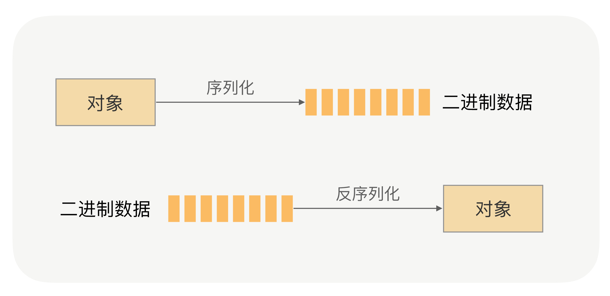
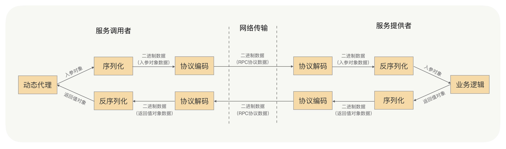
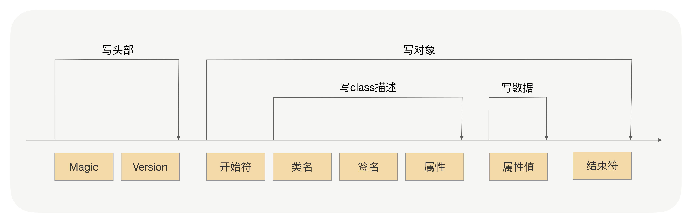
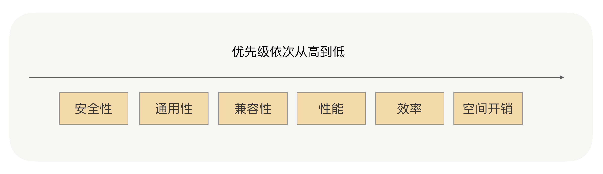

## 什么是序列化

网络传输的数据必须是二进制数据，但调用方请求的出入参数都是对象。对象是不能直接在网络中传输的，所以我们需要提前把它转成可传输的二进制，并且要求转换算法是可逆的，这个过程我们一般叫做“序列化”。 这时，服务提供方就可以正确地从二进制数据中分割出不同的请求，同时根据请求类型和序列化类型，把二进制的消息体逆向还原成请求对象，这个过程我们称之为“反序列化”。

这两个过程如下图所示：

***总结来说***，序列化就是将对象转换成二进制数据的过程，而反序列就是反过来将二进制转换为对象的过程。

## 有哪些序列化

### JDK原生的序列化

JDK自带的序列化机制对使用者而言是非常简单的。序列化具体的实现是由ObjectOutputStream完成的，而反序列化的具体实现是由ObjectInputStream完成的。

### JDK的序列化过程

序列化过程就是在读取对象数据的时候，不断加入一些特殊分隔符，这些特殊分隔符用于在反序列化过程中截断用。

- 头部数据用来声明序列化协议、序列化版本，用于高低版本向后兼容
- 对象数据主要包括类名、签名、属性名、属性类型及属性值，当然还有开头结尾等数据，除了属性值属于真正的对象值，其他都是为了反序列化用的元数据
- 存在对象引用、继承的情况下，就是递归遍历“写对象”逻辑

实际上任何一种序列化框架，核心思想就是设计一种序列化协议，将对象的类型、属性类型、属性值一一按照固定的格式写到二进制字节流中来完成序列化，再按照固定的格式一一读出对象的类型、属性类型、属性值，通过这些信息重新创建出一个新的对象，来完成反序列化。

## JSON
JSON可能是我们最熟悉的一种序列化格式了，JSON是典型的Key-Value方式，没有数据类型，是一种文本型序列化框架

### JSON进行序列化有这样两个问题

- JSON进行序列化的额外空间开销比较大，对于大数据量服务这意味着需要巨大的内存和磁盘开销；
- JSON没有类型，但像Java这种强类型语言，需要通过反射统一解决，所以性能不会太好。

所以如果RPC框架选用JSON序列化，服务提供者与服务调用者之间传输的数据量要相对较小，否则将严重影响性能。

## Hessian

Hessian是动态类型、二进制、紧凑的，并且可跨语言移植的一种序列化框架。Hessian协议要比JDK、JSON更加紧凑，性能上要比JDK、JSON序列化高效很多，而且生成的字节数也更小。相对于JDK、JSON，由于Hessian更加高效，生成的字节数更小，有非常好的兼容性和稳定性，所以Hessian更加适合作为RPC框架远程通信的序列化协议。

但Hessian本身也有问题，官方版本对Java里面一些常见对象的类型不支持,比如：

- Linked系列，LinkedHashMap、LinkedHashSet等，但是可以通过扩展CollectionDeserializer类修复；
- Locale类，可以通过扩展ContextSerializerFactory类修复；
- Byte/Short反序列化的时候变成Integer。

## Protobuf

### 优点

- 序列化后体积相比 JSON、Hessian小很多；
- IDL能清晰地描述语义，所以足以帮助并保证应用程序之间的类型不会丢失，无需类似 XML 解析器；
- 序列化反序列化速度很快，不需要通过反射获取类型；
- 消息格式升级和兼容性不错，可以做到向后兼容。

Protobuf 非常高效，但是对于具有反射和动态能力的语言来说，这样用起来很费劲，这一点就不如Hessian，比如用Java的话，这个预编译过程不是必须的，可以考虑使用Protostuff。

Protostuff不需要依赖IDL文件，可以直接对Java领域对象进行反/序列化操作，在效率上跟Protobuf差不多，生成的二进制格式和Protobuf是完全相同的，可以说是一个Java版本的Protobuf序列化框架。

### Protostuff可能遇到的问题
1. 不支持null；
2. ProtoStuff不支持单纯的Map、List集合对象，需要包在对象里面。
## Rpc中如何选择序列化

性能和效率

空间开销，也就是序列化之后的二进制数据的体积大小。序列化后的字节数据体积越小，网络传输的数据量就越小，传输数据的速度也就越快，由于RPC是远程调用，那么网络传输的速度将直接关系到请求响应的耗时。

序列化协议的通用性和兼容性。在RPC的运营中，序列化问题恐怕是我碰到的和解答过的最多的问题了，经常有业务会向我反馈这个问题，比如某个类型为集合类的入参服务调用者不能解析了，服务提供方将入参类加一个属性之后服务调用方不能正常调用，升级了RPC版本后发起调用时报序列化异常了…

在序列化的选择上，与序列化协议的效率、性能、序列化协议后的体积相比，其通用性和兼容性的优先级会更高，因为他是会直接关系到服务调用的稳定性和可用率的，对于服务的性能来说，服务的可靠性显然更加重要。我们更加看重这种序列化协议在版本升级后的兼容性是否很好，是否支持更多的对象类型，是否是跨平台、跨语言的，是否有很多人已经用过并且踩过了很多的坑，其次我们才会去考虑性能、效率和空间开销。

除了序列化协议的通用性和兼容性，序列化协议的安全性也是非常重要的一个参考因素，甚至应该放在第一位去考虑。以JDK原生序列化为例，它就存在漏洞。如果序列化存在安全漏洞，那么线上的服务就很可能被入侵。

我们首选的还是Hessian与Protobuf，因为他们在性能、时间开销、空间开销、通用性、兼容性和安全性上，都满足了我们的要求。其中Hessian在使用上更加方便，在对象的兼容性上更好；Protobuf则更加高效，通用性上更有优势。

## RPC框架在使用时要注意哪些问题

***对象构造得过于复杂***：属性很多，并且存在多层的嵌套，比如A对象关联B对象，B对象又聚合C对象，C对象又关联聚合很多其他对象，对象依赖关系过于复杂。序列化框架在序列化与反序列化对象时，对象越复杂就越浪费性能，消耗CPU，这会严重影响RPC框架整体的性能；另外，对象越复杂，在序列化与反序列化的过程中，出现问题的概率就越高。

***对象过于庞大***：我经常遇到业务过来咨询，为啥他们的RPC请求经常超时，排查后发现他们的入参对象非常得大，比如为一个大List或者大Map，序列化之后字节长度达到了上兆字节。这种情况同样会严重地浪费了性能、CPU，并且序列化一个如此大的对象是很耗费时间的，这肯定会直接影响到请求的耗时。

***使用序列化框架不支持的类作为入参类***：比如Hessian框架，他天然是不支持LinkedHashMap、LinkedHashSet等，而且大多数情况下最好不要使用第三方集合类，如Guava中的集合类，很多开源的序列化框架都是优先支持编程语言原生的对象。因此如果入参是集合类，应尽量选用原生的、最为常用的集合类，如HashMap、ArrayList。

***对象有复杂的继承关系***：大多数序列化框架在序列化对象时都会将对象的属性一一进行序列化，当有继承关系时，会不停地寻找父类，遍历属性。就像问题1一样，对象关系越复杂，就越浪费性能，同时又很容易出现序列化上的问题。

我们要尽量构建简单的对象作为入参和返回值对象，避免上述问题。