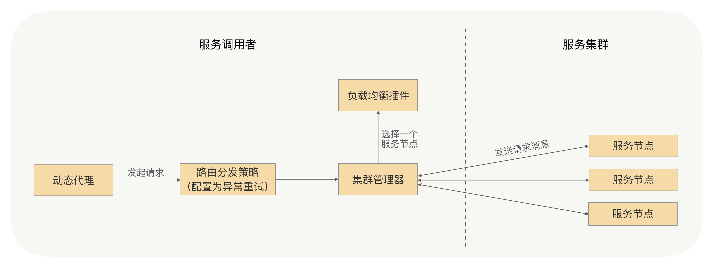
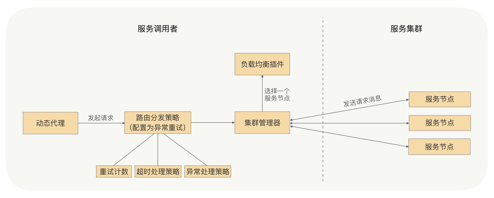

## 为什么需要异常重试？

我们可以考虑这样一个场景。我们发起一次RPC调用，去调用远程的一个服务，比如用户的登录操作，我们会先对用户的用户名以及密码进行验证，验证成功之后会获取用户的基本信息。当我们通过远程的用户服务来获取用户基本信息的时候，恰好网络出现了问题，比如网络突然抖了一下，导致我们的请求失败了，而这个请求我们希望它能够尽可能地执行成功，那这时我们要怎么做呢？

我们需要重新发起一次RPC调用，那我们在代码中该如何处理呢？是在代码逻辑里catch一下，失败了就再发起一次调用吗？这样做显然不够优雅吧。这时我们就可以考虑使用RPC框架的重试机制。

## RPC框架的重试机制

那什么是RPC框架的重试机制呢？

这其实很好理解，就是当调用端发起的请求失败时，RPC框架自身可以进行重试，再重新发送请求，用户可以自行设置是否开启重试以及重试的次数。

那这个机制是如何实现的呢？

还是挺简单的。我们可以回想下[第 11 讲]，通过这一讲我们了解到，调用端在发起RPC调用时，会经过负载均衡，选择一个节点，之后它会向这个节点发送请求信息。当消息发送失败或收到异常消息时，我们就可以捕获异常，根据异常触发重试，重新通过负载均衡选择一个节点发送请求消息，并且记录请求的重试次数，当重试次数达到用户配置的重试次数的时候，就返回给调用端动态代理一个失败异常，否则就一直重试下去。

RPC框架的重试机制就是调用端发现请求失败时捕获异常，之后触发重试，那是不是所有的异常都要触发重试呢？

当然不是了，因为这个异常可能是服务提供方抛回来的业务异常，它是应该正常返回给动态代理的，所以我们要在触发重试之前对捕获的异常进行判定，只有符合重试条件的异常才能触发重试，比如网络超时异常、网络连接异常等等。

了解了RPC框架的重试机制，那用户在使用异常重试时需要注意哪些问题呢？

比如我刚才提的那个调用场景，当网络突然抖动了一下导致请求超时了，但这个时候调用方的请求信息可能已经发送到服务提供方的节点上，也可能已经发送到服务提供方的服务节点上，那如果请求信息成功地发送到了服务节点上，那这个节点是不是就要执行业务逻辑了呢？是的。

那如果这个时候发起了重试，业务逻辑是否会被执行呢？会的。

那如果这个服务业务逻辑不是幂等的，比如插入数据操作，那触发重试的话会不会引发问题呢？会的。

综上，我们可以总结出：在使用RPC框架的时候，我们要确保被调用的服务的业务逻辑是幂等的，这样我们才能考虑根据事件情况开启RPC框架的异常重试功能。这一点你要格外注意，这算是一个高频误区了。

通过上述讲解，我相信你已经非常清楚RPC框架的重试机制了，这也是现在大多数RPC框架所采用的重试机制。

那看到这儿，你觉得这个机制完善了吗？有没有想到连续重试对请求超时时间的影响？继续考虑这样一个场景：我把调用端的请求超时时间设置为5s，结果连续重试3次，每次都耗时2s，那最终这个请求的耗时是6s，那这样的话，调用端设置的超时时间是不是就不准确了呢？

## 如何在约定时间内安全可靠地重试？

我刚才讲到，连续的异常重试可能会出现一种不可靠的情况，那就是连续的异常重试并且每次处理的请求时间比较长，最终会导致请求处理的时间过长，超出用户设置的超时时间。

解决这个问题最直接的方式就是，在每次重试后都重置一下请求的超时时间。

当调用端发起RPC请求时，如果发送请求发生异常并触发了异常重试，我们可以先判定下这个请求是否已经超时，如果已经超时了就直接返回超时异常，否则就先重置下这个请求的超时时间，之后再发起重试。

那么解决了因多次异常重试引发的超时时间失效的问题，这个重试机制是不是就完全可靠了呢？

我们接着考虑，当调用端设置了异常重试策略，发起了一次RPC调用，通过负载均衡选择了节点，将请求消息发送到这个节点，这时这个节点由于负载压力较大，导致这个请求处理失败了，调用端触发了重试，再次通过负载均衡选择了一个节点，结果恰好仍选择了这个节点，那么在这种情况下，重试的效果是否受影响了呢？

当然有影响。因此，我们需要在所有发起重试、负载均衡选择节点的时候，去掉重试之前出现过问题的那个节点，以保证重试的成功率。

那我们现在再完整地回顾一下，考虑了业务逻辑必须是幂等的、超时时间需要重置以及去掉有问题的服务节点后，这样的异常重试机制，还有没有可优化的地方呢？

我刚才讲过，RPC框架的异常重试机制，是调用端发送请求之后，如果发送失败会捕获异常，触发重试，但并不是所有的异常都会触发重试的，只有RPC框架中特定的异常才会如此，比如连接异常、超时异常。

而像服务端业务逻辑中抛回给调用端的异常是不能重试的。那么请你想一下这种情况：服务端的业务逻辑抛给调用端一个异常信息，而服务端抛出这个异常是允许调用端重新发起一次调用的。

比如这个场景：服务端的业务逻辑是对数据库某个数据的更新操作，更新失败则抛出个更新失败的异常，调用端可以再次调用，来触发服务端重新执行更新操作。那这个时候对于调用端来说，它接收到了更新失败异常，虽然是服务端抛回来的业务异常，但也是可以进行重试的。

那么在这种情况下，RPC框架的重试机制需要怎么优化呢？

RPC框架是不会知道哪些业务异常能够去进行异常重试的，我们可以加个重试异常的白名单，用户可以将允许重试的异常加入到这个白名单中。当调用端发起调用，并且配置了异常重试策略，捕获到异常之后，我们就可以采用这样的异常处理策略。如果这个异常是RPC框架允许重试的异常，或者这个异常类型存在于可重试异常的白名单中，我们就允许对这个请求进行重试。

所有可能出现的问题，我们排查了一圈下来之后，一个可靠的重试机制就诞生了，如下图所示：

