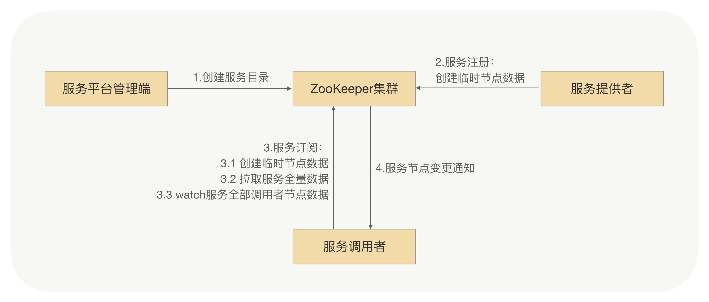
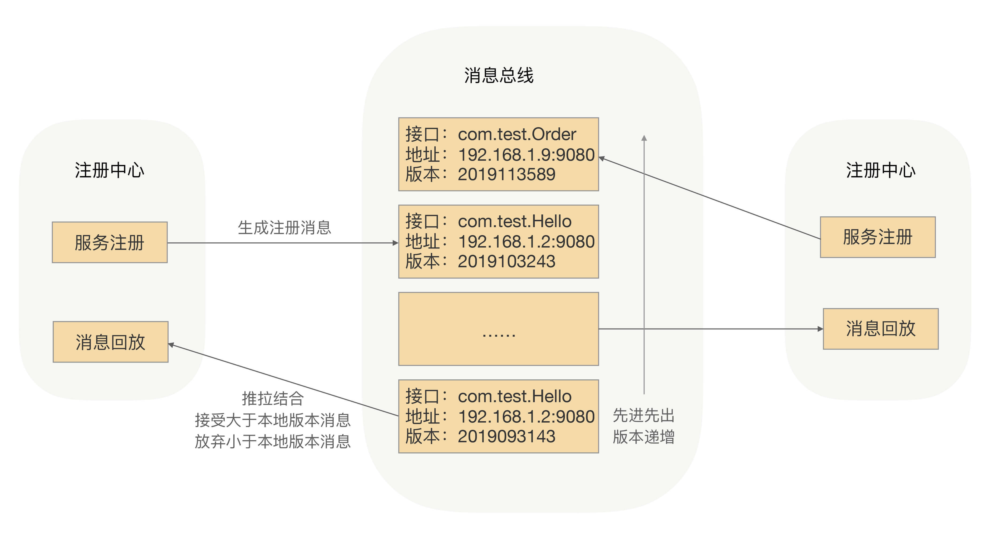

## 基于ZooKeeper的服务发现

那么在RPC里面我们该如何实现呢？我们还是要回到服务发现的本质，就是完成接口跟服务提供者IP之间的映射。这个映射是不是就是一种命名服务？当然，我们还希望注册中心能完成实时变更推送，是不是像开源的ZooKeeper、etcd就可以实现？我很肯定地说“确实可以”。下面我就来介绍下一种基于ZooKeeper的服务发现方式。

整体的思路很简单，就是搭建一个ZooKeeper集群作为注册中心集群，服务注册的时候只需要服务节点向ZooKeeper节点写入注册信息即可，利用ZooKeeper的Watcher机制完成服务订阅与服务下发功能，整体流程如下图：




- 服务平台管理端先在ZooKeeper中创建一个服务根路径，可以根据接口名命名（例如：/service/com.demo.xxService），在这个路径再创建服务提供方目录与服务调用方目录（例如：provider、consumer），分别用来存储服务提供方的节点信息和服务调用方的节点信息。
- 当服务提供方发起注册时，会在服务提供方目录中创建一个临时节点，节点中存储该服务提供方的注册信息。
- 当服务调用方发起订阅时，则在服务调用方目录中创建一个临时节点，节点中存储该服务调用方的信息，同时服务调用方watch该服务的服务提供方目录（/service/com.demo.xxService/provider）中所有的服务节点数据。
- 当服务提供方目录下有节点数据发生变更时，ZooKeeper就会通知给发起订阅的服务调用方。


我所在的技术团队早期使用的RPC框架服务发现就是基于ZooKeeper实现的，并且还平稳运行了一年多，但后续团队的微服务化程度越来越高之后，ZooKeeper集群整体压力也越来越高，尤其在集中上线的时候越发明显。“集中爆发”是在一次大规模上线的时候，当时有超大批量的服务节点在同时发起注册操作，ZooKeeper集群的CPU突然飙升，导致ZooKeeper集群不能工作了，而且我们当时也无法立马将ZooKeeper集群重新启动，一直到ZooKeeper集群恢复后业务才能继续上线。

经过我们的排查，引发这次问题的根本原因就是ZooKeeper本身的性能问题，当连接到ZooKeeper的节点数量特别多，对ZooKeeper读写特别频繁，且ZooKeeper存储的目录达到一定数量的时候，ZooKeeper将不再稳定，CPU持续升高，最终宕机。而宕机之后，由于各业务的节点还在持续发送读写请求，刚一启动，ZooKeeper就因无法承受瞬间的读写压力，马上宕机。

这次“意外”让我们意识到，ZooKeeper集群性能显然已经无法支撑我们现有规模的服务集群了，我们需要重新考虑服务发现方案。

## 基于消息总线的最终一致性的注册中心

我们知道，ZooKeeper的一大特点就是强一致性，ZooKeeper集群的每个节点的数据每次发生更新操作，都会通知其它ZooKeeper节点同时执行更新。它要求保证每个节点的数据能够实时的完全一致，这也就直接导致了ZooKeeper集群性能上的下降。这就好比几个人在玩传递东西的游戏，必须这一轮每个人都拿到东西之后，所有的人才能开始下一轮，而不是说我只要获得到东西之后，就可以直接进行下一轮了。

而RPC框架的服务发现，在服务节点刚上线时，服务调用方是可以容忍在一段时间之后（比如几秒钟之后）发现这个新上线的节点的。毕竟服务节点刚上线之后的几秒内，甚至更长的一段时间内没有接收到请求流量，对整个服务集群是没有什么影响的，所以我们可以牺牲掉CP（强制一致性），而选择AP（最终一致），来换取整个注册中心集群的性能和稳定性。

那么是否有一种简单、高效，并且最终一致的更新机制，能代替ZooKeeper那种数据强一致的数据更新机制呢？

因为要求最终一致性，我们可以考虑采用消息总线机制。注册数据可以全量缓存在每个注册中心内存中，通过消息总线来同步数据。当有一个注册中心节点接收到服务节点注册时，会产生一个消息推送给消息总线，再通过消息总线通知给其它注册中心节点更新数据并进行服务下发，从而达到注册中心间数据最终一致性，具体流程如下图所示：



- 当有服务上线，注册中心节点收到注册请求，服务列表数据发生变化，会生成一个消息，推送给消息总线，每个消息都有整体递增的版本。
- 消息总线会主动推送消息到各个注册中心，同时注册中心也会定时拉取消息。对于获取到消息的在消息回放模块里面回放，只接受大于本地版本号的消息，小于本地版本号的消息直接丢弃，从而实现最终一致性。
- 消费者订阅可以从注册中心内存拿到指定接口的全部服务实例，并缓存到消费者的内存里面。
- 采用推拉模式，消费者可以及时地拿到服务实例增量变化情况，并和内存中的缓存数据进行合并。

为了性能，这里采用了两级缓存，注册中心和消费者的内存缓存，通过异步推拉模式来确保最终一致性

另外，你也可能会想到，服务调用方拿到的服务节点不是最新的，所以目标节点存在已经下线或不提供指定接口服务的情况，这个时候有没有问题？这个问题我们放到了RPC框架里面去处理，在服务调用方发送请求到目标节点后，目标节点会进行合法性验证，如果指定接口服务不存在或正在下线，则会拒绝该请求。服务调用方收到拒绝异常后，会安全重试到其它节点。


通过消息总线的方式，我们就可以完成注册中心集群间数据变更的通知，保证数据的最终一致性，并能及时地触发注册中心的服务下发操作。在RPC领域精耕细作后，你会发现，服务发现的特性是允许我们在设计超大规模集群服务发现系统的时候，舍弃强一致性，更多地考虑系统的健壮性。最终一致性才是分布式系统设计中更为常用的策略。


## 目前服务提供者上线后会自动注册到注册中心，服务调用方会自动感知到新增的实例，并且流量会很快打到该新增的实例。如果我想把某些服务提供者实例的流量切走，除了下线实例，你有没有想到其它更便捷的办法呢


- 使用服务治理工具的流量路由功能

  ：

    - 许多服务治理框架（如 Istio、Consul 等）提供了流量路由规则配置功能。可以通过配置规则，将流量导向其他健康的服务实例，而不再流向指定的服务提供者实例。例如，在 Istio 中，可以使用 VirtualService 和 DestinationRule 来定义流量路由规则，根据不同的条件（如实例标签、版本等）将流量分配到不同的目标实例上。
    - 以 Kubernetes 环境为例，配合 Istio 可以根据 Pod 的标签来设置流量路由。假设要将带有特定标签`app=my-service-v1`的服务提供者实例的流量切走，可以创建一个 VirtualService 资源，指定将目标为`my-service`的流量路由到除了`app=my-service-v1`之外的其他实例上。

- 调整负载均衡策略或权重

  ：

    - 如果使用了负载均衡器（如 Nginx、Apache 等），可以通过调整负载均衡策略或实例的权重来实现流量切走。比如，将需要切走流量的服务提供者实例的权重设置为 0，这样负载均衡器就会尽量少地将流量分配到该实例上。
    - 以 Nginx 为例，在其配置文件中，可以通过`upstream`块来定义后端服务实例，并为每个实例设置权重。例如：


nginx


```nginx
upstream my_service_pool {
    server 192.168.1.100:8080 weight=10;  # 正常服务实例
    server 192.168.1.101:8080 weight=0;    # 要切走流量的实例
}
```


- 利用服务注册中心的隔离功能

  ：

    - 一些服务注册中心（如 Eureka、Zookeeper 等）支持将实例标记为隔离状态。将需要切走流量的服务提供者实例标记为隔离，这样服务调用方在获取服务列表时，就不会将流量发送到这些隔离的实例上。
    - 以 Eureka 为例，可以通过管理界面或 API 将特定实例的状态设置为`OUT_OF_SERVICE`，表示该实例不再接收流量。服务调用方在拉取服务实例列表时，会忽略处于`OUT_OF_SERVICE`状态的实例。


这些方法可以在不实际下线服务提供者实例的情况下，快速有效地将流量从特定实例切走，方便进行维护、升级等操作，并且在需要时可以轻松地将流量恢复到这些实例上。


