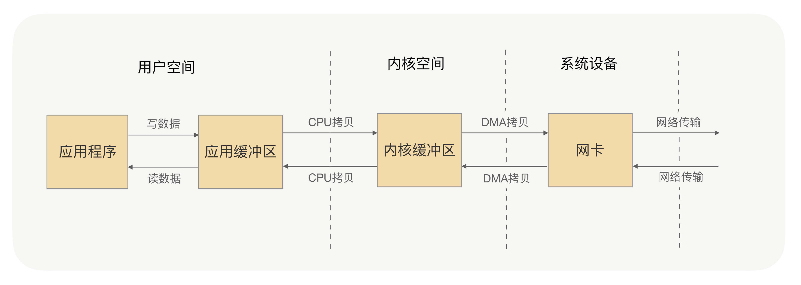
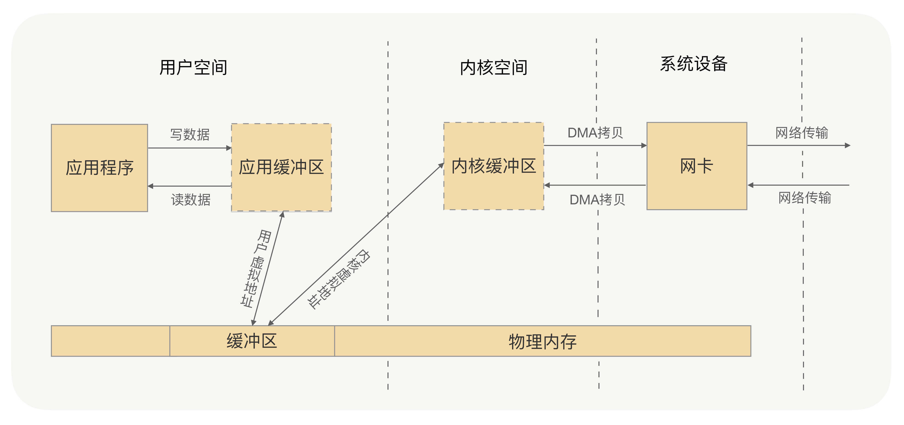

## 为什么说阻塞IO和IO多路复用最为常用

了解完二者的机制，我们就可以回到起初的问题了——我为什么说阻塞IO和IO多路复用最为常用。对比这四种网络IO模型：阻塞IO、非阻塞IO、IO多路复用、异步IO。实际在网络IO的应用上，需要的是系统内核的支持以及编程语言的支持。

在系统内核的支持上，现在大多数系统内核都会支持阻塞IO、非阻塞IO和IO多路复用，但像信号驱动IO、异步IO，只有高版本的Linux系统内核才会支持。

在编程语言上，无论C++还是Java，在高性能的网络编程框架的编写上，大多数都是基于Reactor模式，其中最为典型的便是Java的Netty框架，而Reactor模式是基于IO多路复用的。当然，在非高并发场景下，同步阻塞IO是最为常见的。

综合来讲，在这四种常用的IO模型中，应用最多的、系统内核与编程语言支持最为完善的，便是阻塞IO和IO多路复用。这两种IO模型，已经可以满足绝大多数网络IO的应用场景。

## RPC框架在网络通信上倾向选择哪种网络IO模型

IO多路复用更适合高并发的场景，可以用较少的进程（线程）处理较多的socket的IO请求，但使用难度比较高。当然高级的编程语言支持得还是比较好的，比如Java语言有很多的开源框架对Java原生API做了封装，如Netty框架，使用非常简便；而GO语言，语言本身对IO多路复用的封装就已经很简洁了。

而阻塞IO与IO多路复用相比，阻塞IO每处理一个socket的IO请求都会阻塞进程（线程），但使用难度较低。在并发量较低、业务逻辑只需要同步进行IO操作的场景下，阻塞IO已经满足了需求，并且不需要发起select调用，开销上还要比IO多路复用低。

RPC调用在大多数的情况下，是一个高并发调用的场景，考虑到系统内核的支持、编程语言的支持以及IO模型本身的特点，在RPC框架的实现中，在网络通信的处理上，我们会选择IO多路复用的方式。开发语言的网络通信框架的选型上，我们最优的选择是基于Reactor模式实现的框架，如Java语言，首选的框架便是Netty框架（Java还有很多其他NIO框架，但目前Netty应用得最为广泛），并且在Linux环境下，也要开启epoll来提升系统性能（Windows环境下是无法开启epoll的，因为系统内核不支持）。

## 零拷贝

刚才讲阻塞IO的时候我讲到，系统内核处理IO操作分为两个阶段——等待数据和拷贝数据。等待数据，就是系统内核在等待网卡接收到数据后，把数据写到内核中；而拷贝数据，就是系统内核在获取到数据后，将数据拷贝到用户进程的空间中。以下是具体流程：

应用进程的每一次写操作，都会把数据写到用户空间的缓冲区中，再由CPU将数据拷贝到系统内核的缓冲区中，之后再由DMA将这份数据拷贝到网卡中，最后由网卡发送出去。这里我们可以看到，一次写操作数据要拷贝两次才能通过网卡发送出去，而用户进程的读操作则是将整个流程反过来，数据同样会拷贝两次才能让应用程序读取到数据。

所谓的零拷贝，就是取消用户空间与内核空间之间的数据拷贝操作，应用进程每一次的读写操作，都可以通过一种方式，让应用进程向用户空间写入或者读取数据，就如同直接向内核空间写入或者读取数据一样，再通过DMA将内核中的数据拷贝到网卡，或将网卡中的数据copy到内核。

零拷贝有两种解决方式，分别是 mmap+write 方式和 sendfile 方式，mmap+write方式的核心原理就是通过虚拟内存来解决的。

## Netty中的零拷贝

上面的零拷贝是操作系统层面上的零拷贝，主要目标是避免用户空间与内核空间之间的数据拷贝操作，可以提升CPU的利用率。

而Netty的零拷贝则不大一样，他完全站在了用户空间上，也就是JVM上，它的零拷贝主要是偏向于数据操作的优化上。

在传输过程中，RPC并不会把请求参数的所有二进制数据整体一下子发送到对端机器上，中间可能会拆分成好几个数据包，也可能会合并其他请求的数据包，所以消息都需要有边界。那么一端的机器收到消息之后，就需要对数据包进行处理，根据边界对数据包进行分割和合并，最终获得一条完整的消息。

那收到消息后，对数据包的分割和合并，是在用户空间完成，还是在内核空间完成的呢？

当然是在用户空间，因为对数据包的处理工作都是由应用程序来处理的，那么这里有没有可能存在数据的拷贝操作？可能会存在，当然不是在用户空间与内核空间之间的拷贝，是用户空间内部内存中的拷贝处理操作。Netty的零拷贝就是为了解决这个问题，在用户空间对数据操作进行优化。

那么Netty是怎么对数据操作进行优化的呢？

- Netty 提供了 CompositeByteBuf 类，它可以将多个 ByteBuf 合并为一个逻辑上的 ByteBuf，避免了各个 ByteBuf 之间的拷贝。
- ByteBuf 支持 slice 操作，因此可以将 ByteBuf 分解为多个共享同一个存储区域的 ByteBuf，避免了内存的拷贝。
- 通过 wrap 操作，我们可以将 byte[] 数组、ByteBuf、ByteBuffer 等包装成一个 Netty ByteBuf 对象, 进而避免拷贝操作。

Netty框架中很多内部的ChannelHandler实现类，都是通过CompositeByteBuf、slice、wrap操作来处理TCP传输中的拆包与粘包问题的。

那么Netty有没有解决用户空间与内核空间之间的数据拷贝问题的方法呢？

Netty 的 ByteBuffer 可以采用 Direct Buffers，使用堆外直接内存进行Socket的读写操作，最终的效果与我刚才讲解的虚拟内存所实现的效果是一样的。

Netty 还提供 FileRegion 中包装 NIO 的 FileChannel.transferTo() 方法实现了零拷贝，这与Linux 中的 sendfile 方式在原理上也是一样的。