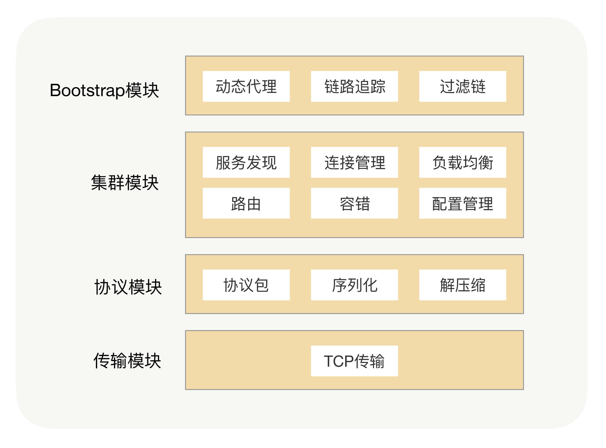
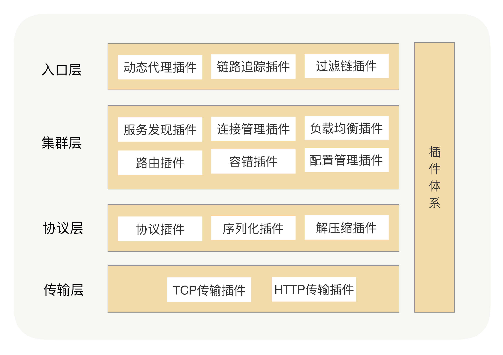

在RPC框架里面，我们是怎么支持插件化架构的呢？我们可以将每个功能点抽象成一个接口，将这个接口作为插件的契约，然后把这个功能的接口与功能的实现分离，并提供接口的默认实现。在Java里面，JDK有自带的SPI（Service Provider Interface）服务发现机制，它可以动态地为某个接口寻找服务实现。使用SPI机制需要在Classpath下的META-INF/services目录里创建一个以服务接口命名的文件，这个文件里的内容就是这个接口的具体实现类。

但在实际项目中，我们其实很少使用到JDK自带的SPI机制，首先它不能按需加载，ServiceLoader加载某个接口实现类的时候，会遍历全部获取，也就是接口的实现类得全部载入并实例化一遍，会造成不必要的浪费。另外就是扩展如果依赖其它的扩展，那就做不到自动注入和装配，这就很难和其他框架集成，比如扩展里面依赖了一个Spring Bean，原生的Java SPI就不支持。

这时，整个架构就变成了一个微内核架构，我们将每个功能点抽象成一个接口，将这个接口作为插件的契约，然后把这个功能的接口与功能的实现分离并提供接口的默认实现。这样的架构相比之前的架构，有很多优势。首先它的可扩展性很好，实现了开闭原则，用户可以非常方便地通过插件扩展实现自己的功能，而且不需要修改核心功能的本身；其次就是保持了核心包的精简，依赖外部包少，这样可以有效减少开发人员引入RPC导致的包版本冲突问题。