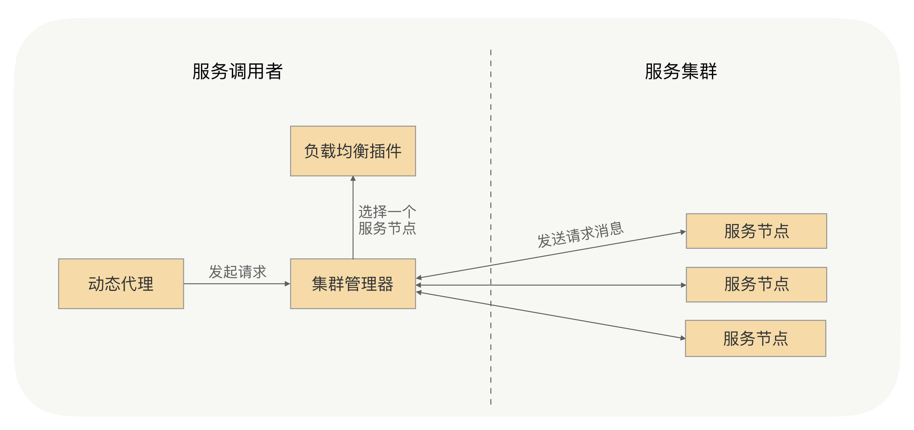
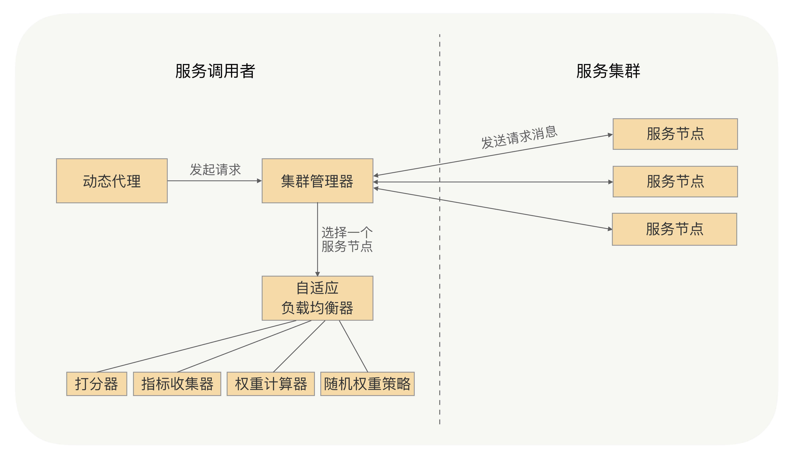

我讲到为什么不通过DNS来实现“服务发现”，之后我又讲解了为什么不采用添加负载均衡设备或者TCP/IP四层代理，域名绑定负载均衡设备的IP或者四层代理IP的方式。

我的回答是这种方式会面临这样几个问题：

- 搭建负载均衡设备或TCP/IP四层代理，需要额外成本；
- 请求流量都经过负载均衡设备，多经过一次网络传输，会额外浪费一些性能；
- 负载均衡添加节点和摘除节点，一般都要手动添加，当大批量扩容和下线时，会有大量的人工操作，“服务发现”在操作上是个问题；
- 我们在服务治理的时候，针对不同接口服务、服务的不同分组，我们的负载均衡策略是需要可配的，如果大家都经过这一个负载均衡设备，就不容易根据不同的场景来配置不同的负载均衡策略了。

我相信看到这儿，你应该已经知道了RPC实现的负载均衡所采用的策略与传统的Web服务实现负载均衡所采用策略的不同之处了。

RPC的负载均衡完全由RPC框架自身实现，RPC的服务调用者会与“注册中心”下发的所有服务节点建立长连接，在每次发起RPC调用时，服务调用者都会通过配置的负载均衡插件，自主选择一个服务节点，发起RPC调用请求。

由于负载均衡机制完全是由RPC框架自身实现的，所以它不再需要依赖任何负载均衡设备，自然也不会发生负载均衡设备的单点问题，服务调用方的负载均衡策略也完全可配，同时我们可以通过控制权重的方式，对负载均衡进行治理。

## 如何设计自适应的负载均衡？

我刚才讲过，RPC的负载均衡完全由RPC框架自身实现，服务调用者发起请求时，会通过配置的负载均衡插件，自主地选择服务节点。那是不是只要调用者知道每个服务节点处理请求的能力，再根据服务处理节点处理请求的能力来判断要打给它多少流量就可以了？当一个服务节点负载过高或响应过慢时，就少给它发送请求，反之则多给它发送请求。

这就有点像日常工作中的分配任务，要多考虑实际情况。当一位下属身体欠佳，就少给他些工作；若刚好另一位下属状态很好，手头工作又不是很多，就多分给他一点。

那服务调用者节点又该如何判定一个服务节点的处理能力呢？

这里我们可以采用一种打分的策略，服务调用者收集与之建立长连接的每个服务节点的指标数据，如服务节点的负载指标、CPU核数、内存大小、请求处理的耗时指标（如请求平均耗时、TP99、TP999）、服务节点的状态指标（如正常、亚健康）。通过这些指标，计算出一个分数，比如总分10分，如果CPU负载达到70%，就减它3分，当然了，减3分只是个类比，需要减多少分是需要一个计算策略的。

我们又该如果根据这些指标来打分呢？

这就有点像公司对员工进行年终考核。假设我是老板，我要考核专业能力、沟通能力和工作态度，这三项的占比分别是30%、30%、40%，我给一个员工的评分是10、8、8，那他的综合分数就是这样计算的：10*30%+8*30%+8*40%=8.6分。

给服务节点打分也一样，我们可以为每个指标都设置一个指标权重占比，然后再根据这些指标数据，计算分数。

服务调用者给每个服务节点都打完分之后，会发送请求，那这时候我们又该如何根据分数去控制给每个服务节点发送多少流量呢？

我们可以配合随机权重的负载均衡策略去控制，通过最终的指标分数修改服务节点最终的权重。例如给一个服务节点综合打分是8分（满分10分），服务节点的权重是100，那么计算后最终权重就是80（100*80%）。服务调用者发送请求时，会通过随机权重的策略来选择服务节点，那么这个节点接收到的流量就是其他正常节点的80%（这里假设其他节点默认权重都是100，且指标正常，打分为10分的情况）。

到这儿，一个自适应的负载均衡我们就完成了，整体的设计方案如下图所示：

关键步骤我来解释下：

- 添加服务指标收集器，并将其作为插件，默认有运行时状态指标收集器、请求耗时指标收集器。
- 运行时状态指标收集器收集服务节点CPU核数、CPU负载以及内存等指标，在服务调用者与服务提供者的心跳数据中获取。
- 请求耗时指标收集器收集请求耗时数据，如平均耗时、TP99、TP999等。
- 可以配置开启哪些指标收集器，并设置这些参考指标的指标权重，再根据指标数据和指标权重来综合打分。
- 通过服务节点的综合打分与节点的权重，最终计算出节点的最终权重，之后服务调用者会根据随机权重的策略，来选择服务节点。